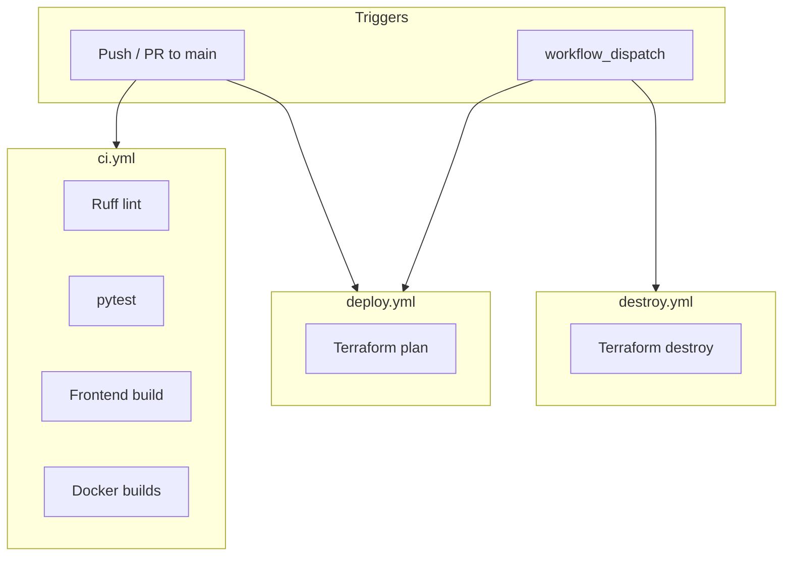

# Pharmacy AI Assistant

**Course project — AICO Assessment III**  
**Student:** building on solid full-stack habits; still leveling up on RAG, cloud, and DevOps.

This app is a **pharmacy-themed RAG assistant**: it answers questions about **tablet imprint identification** (educational samples) and **DEA controlled-substance schedules**, using documents I loaded into a vector store—not a free-floating chatbot.

> **Not medical or legal advice.** Educational demo only. Always verify against current DEA/FDA sources and a licensed pharmacist.

---

## What a TA should see in five minutes

| Goal | Where to look |
|------|----------------|
| Run it locally | [Quick start](#quick-start-local-docker) → `scripts/run.sh` |
| Rubric checklist | [Assessment rubric map](#assessment-rubric-map) (links to exact files) |
| How RAG works here | [How the AI piece works](#how-the-ai-piece-works-rag) |
| Docker | `docker-compose.yml`, `backend/Dockerfile`, `frontend/Dockerfile` |
| AWS / Terraform | `terraform/`, [docs/aws-deploy.md](docs/aws-deploy.md) |
| CI/CD | `.github/workflows/`, Actions tab on GitHub |
| Tests | `backend/tests/`, `bash scripts/run.sh test` |
| Domain focus | `backend/source_data/`, `backend/prompts.py` |

**Repo:** https://github.com/bjslusher/pharmacy-ai-assistant  
**Actions:** https://github.com/bjslusher/pharmacy-ai-assistant/actions

---

## Project in plain language

I am comfortable wiring a **React frontend** to a **FastAPI backend**. For this assessment I added layers I am still practicing:

1. **RAG** — embed pharmacy seed docs, retrieve relevant chunks, then ask the LLM to answer *from that context*.
2. **Docker** — one command brings up frontend, backend, and local Ollama.
3. **Terraform + AWS** — EC2 + S3 (Free Tier–oriented defaults), with the instance syncing knowledge from S3 at boot.
4. **GitHub Actions** — lint/test/build on every push; Terraform plan workflow; manual destroy.

The “product” angle is intentional: instead of a generic chat bot, the prompts and seed data target **med ID + DEA schedules** so reviewers can ask known questions (e.g. imprint `M367`, Schedule II refills) and see grounded answers.

```
Browser (React/Vite)
    → FastAPI (main.py)
        → PharmacyRAG (rag_service.py) + prompts.py
            → Chroma vector store ← backend/source_data/*.txt
            → Ollama (local) or optional cloud LLM
            → optional Mem0 memory
```

---

## Assessment rubric map

Use this table while grading. Each row is a typical Assessment III checkpoint with **where it lives in this repo**.

| Rubric area | What I implemented | Locate it here |
|-------------|--------------------|----------------|
| **RAG pipeline** | Retrieve-then-generate over pharmacy docs; Chroma index; query expansion | [backend/rag_service.py](backend/rag_service.py), [backend/prompts.py](backend/prompts.py) |
| **LangChain usage** | LLM + embeddings + retrieval wired in the RAG service | [backend/rag_service.py](backend/rag_service.py), [backend/requirements.txt](backend/requirements.txt) |
| **Vector / knowledge base** | Seed TXT files indexed at startup; optional `/api/ingest` | [backend/source_data/](backend/source_data/), ingest in [backend/main.py](backend/main.py) |
| **Mem0 (memory)** | Optional; enabled when `MEM0_API_KEY` is set | [backend/rag_service.py](backend/rag_service.py), [backend/.env.example](backend/.env.example) |
| **Domain specialization** | Pharmacy prompts, imprint examples, DEA schedule overview | [backend/prompts.py](backend/prompts.py), [backend/source_data/common_controlled_imprints.txt](backend/source_data/common_controlled_imprints.txt), [backend/source_data/dea_schedules_overview.txt](backend/source_data/dea_schedules_overview.txt) |
| **Backend API** | FastAPI: chat, med ID, DEA mode, health, stats, ingest | [backend/main.py](backend/main.py) → also http://localhost:8000/docs when running |
| **Frontend** | React chat UI, med-ID form, quick questions, structured error display | [frontend/src/App.jsx](frontend/src/App.jsx), [frontend/src/apiErrors.js](frontend/src/apiErrors.js), [frontend/src/index.css](frontend/src/index.css) |
| **Docker** | Multi-service Compose: backend, frontend, Ollama | [docker-compose.yml](docker-compose.yml), [backend/Dockerfile](backend/Dockerfile), [frontend/Dockerfile](frontend/Dockerfile) |
| **Orchestration / DX** | One script: preflight → up → models → health; AWS subcommands | [scripts/run.sh](scripts/run.sh), [scripts/preflight.sh](scripts/preflight.sh) |
| **Terraform (IaC)** | EC2, S3 data/logs, IAM role, SG, user_data bootstrap | [terraform/main.tf](terraform/main.tf), [terraform/variables.tf](terraform/variables.tf), [terraform/user_data.sh.tpl](terraform/user_data.sh.tpl) |
| **AWS usage** | S3 holds seed docs; EC2 **syncs from S3 at startup** then runs Compose | [docs/aws-deploy.md](docs/aws-deploy.md), user_data template above |
| **Free Tier awareness** | Defaults: `t3.micro`, 30 GB volume, small Ollama model | [terraform/free-tier.tfvars](terraform/free-tier.tfvars), [terraform/variables.tf](terraform/variables.tf) |
| **CI (GitHub Actions)** | Ruff, pytest, frontend build, Docker image builds | [.github/workflows/ci.yml](.github/workflows/ci.yml) |
| **CD / infra workflows** | Terraform **plan** (not auto-apply); manual **destroy** | [.github/workflows/deploy.yml](.github/workflows/deploy.yml), [.github/workflows/destroy.yml](.github/workflows/destroy.yml) |
| **Automated tests** | Unit + API integration tests with mocked RAG (no live LLM required in CI) | [backend/tests/](backend/tests/) |
| **Error handling** | Structured API `{ code, message, detail, hint }`; UI shows code + hint | [backend/main.py](backend/main.py), [docs/error-handling.md](docs/error-handling.md), [frontend/src/apiErrors.js](frontend/src/apiErrors.js) |
| **Fail-fast ops** | Preflight before long Docker/AWS work | [scripts/preflight.sh](scripts/preflight.sh), [scripts/aws_preflight.sh](scripts/aws_preflight.sh), [docs/preflight.md](docs/preflight.md) |
| **Documentation** | This README + focused docs under `docs/` | [docs/](docs/), [docs/sources.md](docs/sources.md) |
| **Safety / limits** | Educational seed only; disclaimers in UI and API | This README, frontend disclaimer card, API `disclaimer` field |

### Suggested TA demo questions (grounded in seed data)

| Ask | Should roughly answer |
|-----|------------------------|
| Identify white oval tablet imprint **M367** | Hydrocodone 10 mg / acetaminophen 325 mg; Schedule II |
| Can **Schedule II** prescriptions be refilled (federal)? | No federal refills; new prescription required |
| Difference between Schedule **III** and **IV** | Seed overview of abuse potential and refill rules |

API equivalents: `POST /api/meds/identify`, `POST /api/dea/query`, `POST /api/chat`.

---

## Quick start (local Docker)

**Prerequisites:** Docker + Docker Compose (Docker Desktop with WSL2 is fine).

```bash
git clone https://github.com/bjslusher/pharmacy-ai-assistant.git
cd pharmacy-ai-assistant

# Optional: catch missing tools/ports/seed files before a long build
bash scripts/run.sh preflight

# Build, start, pull models, wait for health
bash scripts/run.sh
```

| URL | Purpose |
|-----|---------|
| http://localhost:3000 | Frontend |
| http://localhost:8000/docs | OpenAPI / Swagger |
| http://localhost:8000/api/health | Health + document count |

```bash
bash scripts/run.sh status   # containers + health
bash scripts/run.sh test     # pytest
bash scripts/run.sh logs     # follow logs
bash scripts/run.sh stop     # tear down
```

First run can take a while (image builds + Ollama model download).

---

## How the AI piece works (RAG)

I am still learning the finer points of retrieval quality, but the pipeline is intentional:

1. **Seed documents** in `backend/source_data/` describe imprints and DEA schedules in plain text.
2. On startup, the backend **embeds** those docs into **Chroma** (`PharmacyRAG.ensure_index()` in `rag_service.py`).
3. A user question is optionally **expanded** with pharmacy term aliases (`prompts.expand_query`).
4. The service **retrieves** similar chunks, then calls the LLM with a **pharmacy-focused system prompt** so the answer should stay on domain and include a disclaimer.
5. Modes:
   - `general` → `/api/chat`
   - `med_id` → `/api/meds/identify`
   - `dea` → `/api/dea/query`

**Honest limit:** imprint coverage is only the educational sample in the repo—not a full pill database. Unknown codes should be treated cautiously.

**LLM:** default local path is **Ollama** in Compose. Cloud providers can be configured via env (see `.env.example`); I practiced the local path most.

**Mem0:** optional conversational memory when an API key is present—wired so the project meets the “memory” checkpoint without requiring every reviewer to have a key.

---

## Full-stack layout

| Layer | Stack | Entry |
|-------|--------|--------|
| Frontend | React, Vite, nginx in production image | `frontend/` |
| Backend | FastAPI, Pydantic, structured errors | `backend/main.py` |
| RAG | LangChain-style service, Chroma, prompts | `backend/rag_service.py`, `prompts.py` |
| Data | Educational TXT seeds | `backend/source_data/` |
| Local ops | Compose + `scripts/run.sh` | `docker-compose.yml` |
| Cloud | Terraform AWS | `terraform/` |
| CI/CD | GitHub Actions | `.github/workflows/` |

### Main API routes

| Method | Path | Role |
|--------|------|------|
| GET | `/api/health` | Liveness + indexed doc count + startup error if degraded |
| POST | `/api/chat` | General RAG chat |
| POST | `/api/meds/identify` | Medication / imprint mode |
| POST | `/api/dea/query` | DEA / schedule mode |
| POST | `/api/ingest` | Upload extra `.txt` / `.md` / `.pdf` into the index |
| GET | `/api/stats` | Simple stats |

---

## Docker

Three services in [docker-compose.yml](docker-compose.yml):

| Service | Role |
|---------|------|
| `backend` | FastAPI RAG API |
| `frontend` | Static UI behind nginx |
| `ollama` | Local LLM + embeddings |

This is the primary “it runs the same on my machine” path for the assessment.

---

## AWS & Terraform (learning DevOps in public)

I treated cloud as a real deploy path, not only a stub:

- **S3 data bucket** — seed files uploaded by Terraform; EC2 **syncs them at boot**.
- **S3 logs bucket** — access/bootstrap markers.
- **IAM instance profile** — EC2 talks to S3 without baking in long-lived keys on disk.
- **EC2** — Free Tier–oriented `t3.micro` by default; `user_data` installs Docker, clones the repo, syncs S3, starts Compose.

```bash
bash scripts/run.sh aws preflight   # fail-fast: CLI, STS, S3/EC2 APIs
bash scripts/run.sh aws plan
bash scripts/run.sh aws apply       # creates resources (costs money outside Free Tier)
bash scripts/run.sh aws destroy     # tear down when done
```

Details: [docs/aws-deploy.md](docs/aws-deploy.md), [docs/aws-preflight.md](docs/aws-preflight.md), [docs/aws-profiles.md](docs/aws-profiles.md).

GitHub **Deploy** workflow stays **plan-first** so a push does not surprise-bill a reviewer. Apply from a machine with credentials (or extend the workflow deliberately).

---

## CI/CD



| Workflow | File | Intent |
|----------|------|--------|
| CI | [ci.yml](.github/workflows/ci.yml) | Lint, test, build frontend, build images |
| Deploy | [deploy.yml](.github/workflows/deploy.yml) | Terraform init/validate/plan |
| Destroy | [destroy.yml](.github/workflows/destroy.yml) | Manual destroy when secrets exist |

Optional secrets for real cloud plan/destroy: `AWS_ACCESS_KEY_ID`, `AWS_SECRET_ACCESS_KEY`, `AWS_REGION`.

---

## Tests & quality

```bash
bash scripts/run.sh test
# or: cd backend && PYTHONPATH=. pytest -q tests/
```

| File | Focus |
|------|--------|
| `test_expand_query.py` | Pharmacy query expansion |
| `test_api_models.py` | Request validation |
| `test_rag_helpers.py` | RAG helpers |
| `test_integration_api.py` | FastAPI TestClient + mocked RAG |

CI also runs **Ruff** ([backend/pyproject.toml](backend/pyproject.toml)).

---

## Error handling (readable for operators)

API errors prefer a stable shape:

```json
{
  "error": {
    "code": "VALIDATION_ERROR",
    "message": "...",
    "status": 422,
    "hint": "..."
  }
}
```

The frontend parses that and shows **code**, **HTTP status**, **message**, and **hint** ([frontend/src/apiErrors.js](frontend/src/apiErrors.js)). More detail: [docs/error-handling.md](docs/error-handling.md).

---

## Official sources (reference only — full PDFs not vendored)

Summaries in-repo point at public materials; see [docs/sources.md](docs/sources.md).

Examples: [DEA drug scheduling](https://www.dea.gov/drug-information/drug-scheduling), [eCFR 21 CFR 1308](https://www.ecfr.gov/current/title-21/chapter-II/part-1308), [FDA NDC Directory](https://www.fda.gov/drugs/drug-approvals-and-databases/national-drug-code-directory), [DailyMed](https://dailymed.nlm.nih.gov/dailymed/).

---

## What I know vs what I am still learning

| Stronger (full-stack) | Still learning (AI / cloud / DevOps) |
|----------------------|--------------------------------------|
| React UI, FastAPI routes, JSON contracts | Retrieval quality, embeddings tradeoffs |
| Docker Compose for a three-service app | Production hardening of LLM services |
| Structured validation and HTTP errors | IAM least-privilege at scale |
| Writing tests around the API | Terraform state backends, multi-env CD |

I would rather the README be honest about that than sound like a senior MLOps resume.

---

## Limitations

- Imprint data is a **small educational set**, not a commercial identifier.
- DEA content is a **summary** for learning—confirm with the Pharmacist’s Manual and current CFR.
- Do not enter real patient information.
- Local Ollama quality depends on the model pulled; AWS Free Tier `t3.micro` will be slow.

---

## License / use

Educational assessment project. Government publications remain under their own terms; in-repo text is for learning only.
