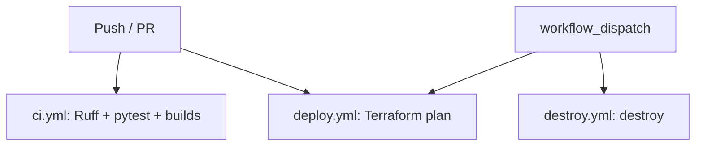

# Pharmacy AI Assistant

**AICO Assessment III** · Sonoran Forge branding  
Medication **imprint identification** + **DEA schedule** guidance via **RAG** (answers are grounded in Chroma, not free-floating chat).

> **Not medical or legal advice.** Educational demo only. Verify against current DEA/FDA sources and a licensed pharmacist.

| | |
|--|--|
| **Repo** | https://github.com/bjslusher/pharmacy-ai-assistant |
| **CI** | https://github.com/bjslusher/pharmacy-ai-assistant/actions |
| **Security notes** | [docs/security.md](docs/security.md) |
| **Rubric self-check** | `bash scripts/run.sh postflight` |

---

## Quick start

```bash
git clone https://github.com/bjslusher/pharmacy-ai-assistant.git
cd pharmacy-ai-assistant
git pull origin main

bash scripts/run.sh              # local Docker (preflight → compose → models → health)
# open http://localhost:3000

bash scripts/run.sh full --yes   # local + AWS (S3, ALB, ASG)
bash scripts/run.sh stop --yes   # Docker down → terraform destroy → post-flight audit
```

After a successful start you get an **OPEN THE APP HERE** box with local and AWS URLs.

| URL | Purpose |
|-----|---------|
| http://localhost:3000 | Frontend (brand pack UI) |
| http://localhost:8000/docs | OpenAPI |
| http://localhost:8000/api/health | Health + Chroma index status |
| http://localhost:8000/api/agent/info | LangGraph agent description (no LLM call) |

---

## Architecture

```text
Browser (React + Sonoran Forge brand pack)
    → FastAPI (main.py)
        → PharmacyRAG + prompts          # linear /api/chat (default)
        → PharmacyAgent (LangGraph)      # /api/agent/chat — classify → Chroma tool → answer
            → Chroma ← backend/source_data/*.txt   # sole knowledge source
            → Ollama (local) or optional cloud LLM
            → optional Mem0 / LangSmith

AWS (optional demo):
  Internet → ALB :80
               ├─ /api/* → ASG :8000
               └─ /*     → ASG :3000
  S3 data bucket → seed sync at EC2 user_data boot
```

| Layer | Stack | Path |
|-------|--------|------|
| Frontend | React, Vite, nginx + brand pack | `frontend/`, `docs/brand/` |
| Backend | FastAPI, structured errors | `backend/main.py` |
| RAG | Chroma, embeddings, pharmacy prompts | `backend/rag_service.py`, `prompts.py` |
| Agent (bonus) | LangGraph router + Chroma tools | `backend/agents/` |
| Local ops | Compose + orchestrator | `docker-compose.yml`, `scripts/run.sh` |
| Cloud | Terraform: S3, IAM, ALB, ASG | `terraform/` |
| CI/CD | Ruff, pytest, builds, TF plan, destroy | `.github/workflows/` |

---

## Security: risks and mitigations

Demos and screenshots often capture terminal output. This project treats **identity and secrets** carefully.

| Risk | What could go wrong | Mitigation in this repo |
|------|---------------------|-------------------------|
| **AWS secret key / session token in logs** | Credential theft if a terminal is shared or committed | Values are **never printed**. Preflight only says “present (value hidden)”. |
| **Access key ID (`AKIA…`) in logs** | Helps attackers target the right key | Partial mask only (`AKIA************XXXX`) if presence is shown. |
| **Full AWS account ID in screenshots** | Account enumeration / correlation | Preflight prints **`****` + last 4** by default. |
| **Full IAM ARN (`…user/Brian`)** | Reveals principal name + account | Masked to `arn:aws:iam::****XXXX:user/B***`. |
| **`.env` / API keys in git** | Keys in public history | `.env`, `backend/.env`, `*.pem`, `*.tfstate`, real `*.tfvars` are **gitignored**. Use `.env.example` only. |
| **Secrets in GitHub Actions** | Leaked workflow logs | Workflows use `${{ secrets.* }}` — do not hard-code keys in YAML. |
| **Terraform state with data** | State can hold resource identifiers | `*.tfstate` gitignored; destroy on `run.sh stop`. |
| **LLM / Mem0 / LangSmith keys** | Third-party account abuse | Optional env vars only; never logged by design. |

**Default preflight output (safe for demos):**

```text
  [OK]  account: ****4728
  [OK]  identity: arn:aws:iam::****4728:user/B***
=== PREFLIGHT PASSED — safe to plan/apply ===
  profile=default region=us-east-1 account=****4728
```

**Opt-in full identity (private machine only — not while screen-sharing):**

```bash
AWS_PREFLIGHT_SHOW_IDENTITY=1 bash scripts/aws_preflight.sh
```

Shared helpers: [`scripts/redact.sh`](scripts/redact.sh) · policy: [`docs/security.md`](docs/security.md) · AWS checks: [`docs/aws-preflight.md`](docs/aws-preflight.md)

If an older screenshot already showed a full account ID, treat it as sensitive in public posts. **Rotate access keys** if a *secret* key was ever pasted into chat or a public gist.

---

## Assessment rubric map

| Rubric area | Implementation | Locate |
|-------------|----------------|--------|
| RAG pipeline | Retrieve-then-generate; query expansion | `backend/rag_service.py`, `prompts.py` |
| LangChain / embeddings | Ollama (default) via env | `rag_service.py`, `requirements.txt` |
| Knowledge base | Seed TXT + optional ingest | `backend/source_data/`, `POST /api/ingest` |
| Mem0 | Optional when `MEM0_API_KEY` set | `rag_service.py`, `.env.example` |
| **Agent (bonus)** | LangGraph classify → Chroma tools → answer | `backend/agents/`, `POST /api/agent/chat` |
| **LangSmith (bonus)** | Optional tracing | `agents/tracing.py`, `.env.example` |
| Domain focus | Imprints + DEA schedules | `prompts.py`, `source_data/*.txt` |
| Backend API | chat, med ID, DEA, agent, health, stats, ingest | `backend/main.py`, `/docs` |
| Frontend | Chat UI, errors, brand pack | `frontend/src/`, `docs/brand/` |
| Docker | backend + frontend + ollama | `docker-compose.yml` (+ GPU overlay) |
| Orchestration | Preflight → up; sequential stop + postflight | `scripts/run.sh` |
| Terraform / AWS | S3, IAM, ALB, ASG, user_data | `terraform/main.tf` |
| Free Tier bias | `t3.micro`, small model (ALB is **not** free) | `free-tier.tfvars` |
| CI | Ruff + pytest + builds | `.github/workflows/ci.yml` |
| Tests | Unit + integration + stress + agent | `backend/tests/` |
| Errors | `{ code, message, detail, hint }` + UI | `main.py`, `docs/error-handling.md` |
| Security hygiene | Masked identity, gitignored secrets | `docs/security.md` |

After teardown, run the color-coded audit:

```bash
bash scripts/run.sh postflight
# GREEN = required feature · ORANGE = bonus · BLUE = GitHub artifact · RED = missing
```

Details: [`docs/postflight-rubric.md`](docs/postflight-rubric.md)

### Demo questions (seed data)

| Ask | Expect |
|-----|--------|
| Imprint **M367** | Hydrocodone/APAP; Schedule II (from seed) |
| Schedule II refills (federal) | No federal refills (from seed) |
| III vs IV | Abuse potential / refill differences in seed text |

Agent path (shows tool choice):

```bash
curl -s http://localhost:8000/api/agent/chat \
  -H 'Content-Type: application/json' \
  -d '{"message":"Can Schedule II be refilled?"}' | python3 -m json.tool
# → intent, tool_used (search_dea), steps, answer from Chroma only
```

---

## Commands

| Command | What it does |
|---------|----------------|
| `bash scripts/run.sh` | Local stack only |
| `bash scripts/run.sh full [--yes]` | Preflight → Docker → TF plan → apply |
| `bash scripts/run.sh stop [--yes]` | Compose down → **terraform destroy** → **postflight** |
| `bash scripts/run.sh status` | Containers + health + access box |
| `bash scripts/run.sh test` | pytest (unit + integration + agent + stress) |
| `bash scripts/run.sh postflight` | Rubric feature audit (no teardown) |
| `bash scripts/run.sh aws plan\|apply\|destroy` | Cloud only |
| `bash scripts/aws_preflight.sh` | Fail-fast AWS checks (masked identity) |

**AWS destroy note:** First ASG teardown can take several minutes. `force_delete = true` reduces hang risk. Always destroy when the demo is done — ALB incurs cost.

---

## API

| Method | Path | Role |
|--------|------|------|
| GET | `/api/health` | Liveness + Chroma status |
| POST | `/api/chat` | Linear RAG (default) |
| POST | `/api/chat/stream` | SSE streaming RAG |
| POST | `/api/meds/identify` | Imprint / med ID mode |
| POST | `/api/dea/query` | DEA / schedule mode |
| POST | `/api/agent/chat` | **LangGraph agent** (auto tool route) |
| GET | `/api/agent/info` | Agent graph description |
| POST | `/api/ingest` | Extra documents |
| GET | `/api/stats` | Counts + agent/LangSmith flags |

---

## Branding (Sonoran Forge)

Assets: [`docs/brand/`](docs/brand/) (favicon, circular badge, banner lockup, app icons).  
Frontend Docker build copies them into `public/brand/` (compose build context = **repo root**).

---

## Tests

```bash
bash scripts/run.sh test
# or
cd backend && PYTHONPATH=. pytest -q tests/
```

| Suite | Focus |
|-------|--------|
| `test_expand_query.py` | Term aliases |
| `test_api_models.py` | Validation |
| `test_rag_helpers.py` | Helpers |
| `test_integration_api.py` | chat / meds / dea / health / ingest |
| `test_agent.py` | Intent routing + Chroma tools |
| `test_stress_api.py` | Concurrent load (mocked RAG) |

---

## CI/CD



Apply/destroy from a credentialed machine for real resources: `bash scripts/run.sh aws apply|destroy`.

---

## Limitations

- Imprint set is educational, not a full commercial database.
- DEA text is a learning summary — confirm with the Pharmacist’s Manual / CFR.
- No real patient data.
- `t3.micro` + small models are slow; ALB incurs cost — **destroy when done**.
- Agent still answers **only** from Chroma; it does not browse the web.

---

## License / use

Educational assessment project. Government publications remain under their own terms.
