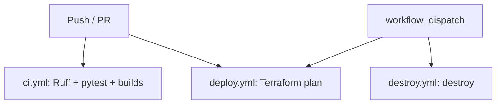

# Pharmacy AI Assistant

**AICO Assessment III** · **Sonoran Forge** branding  
Medication imprint identification + DEA schedule guidance via RAG (not a free-floating chatbot).

> **Not medical or legal advice.** Educational demo only. Verify against current DEA/FDA sources and a licensed pharmacist.

**Repo:** https://github.com/bjslusher/pharmacy-ai-assistant  
**CI:** https://github.com/bjslusher/pharmacy-ai-assistant/actions

---

## Quick start

```bash
git clone https://github.com/bjslusher/pharmacy-ai-assistant.git
cd pharmacy-ai-assistant

bash scripts/run.sh              # local Docker (preflight → compose → models → health)
# open http://localhost:3000

bash scripts/run.sh full --yes   # local + AWS (S3, ALB, ASG)
bash scripts/run.sh stop --yes   # Docker down, then terraform destroy
```

After every successful start you get an **OPEN THE APP HERE** box with local and AWS URLs.

| URL | Purpose |
|-----|---------|
| http://localhost:3000 | Frontend (brand pack UI) |
| http://localhost:8000/docs | OpenAPI |
| http://localhost:8000/api/health | Health + document count |

---

## Architecture

```text
Browser (React + Sonoran Forge brand pack)
    → FastAPI (main.py)
        → PharmacyRAG + prompts
            → Chroma ← backend/source_data/*.txt
            → Ollama (local) or optional cloud LLM
            → optional Mem0

AWS (optional):
  Internet → ALB :80
               ├─ /api/* → ASG instances :8000
               └─ /*     → ASG instances :3000
  S3 data bucket → seed sync at EC2 user_data boot
```

| Layer | Stack | Path |
|-------|--------|------|
| Frontend | React, Vite, nginx; brand pack PNGs at build | `frontend/`, `docs/brand/` |
| Backend | FastAPI, structured errors | `backend/main.py` |
| RAG | Chroma, LangChain-style service, pharmacy prompts | `backend/rag_service.py`, `prompts.py` |
| Local ops | Compose + orchestrator | `docker-compose.yml`, `scripts/run.sh` |
| Cloud | Terraform: S3, IAM, **ALB**, **ASG** (1–2× EC2), launch template | `terraform/` |
| CI/CD | Ruff, pytest, frontend build, Docker builds; TF plan; manual destroy | `.github/workflows/` |

---

## Assessment rubric map

| Rubric area | Implementation | Locate |
|-------------|----------------|--------|
| RAG pipeline | Retrieve-then-generate; query expansion | `backend/rag_service.py`, `prompts.py` |
| LangChain / embeddings | Ollama or cloud via env | `rag_service.py`, `requirements.txt` |
| Knowledge base | Seed TXT + optional ingest | `backend/source_data/`, `POST /api/ingest` |
| Mem0 | Optional when `MEM0_API_KEY` set | `rag_service.py`, `.env.example` |
| Domain focus | Imprints + DEA schedules | `prompts.py`, `source_data/*.txt` |
| Backend API | chat, med ID, DEA, health, stats, ingest | `backend/main.py`, `/docs` |
| Frontend | Chat, identify form, errors, **brand pack** | `frontend/src/`, `docs/brand/` |
| Docker | backend + frontend + ollama | `docker-compose.yml` |
| Orchestration | Preflight → up; sequential stop | `scripts/run.sh`, `preflight.sh` |
| Terraform / AWS | S3, IAM, **ALB**, **ASG**, user_data | `terraform/main.tf`, `docs/aws-deploy.md` |
| Free Tier bias | `t3.micro`, 30 GB, small model (ALB is **not** free) | `variables.tf`, `free-tier.tfvars` |
| CI | Ruff + pytest + builds | `ci.yml` |
| Tests | Unit + integration + **stress** | `backend/tests/` |
| Errors | `{ code, message, detail, hint }` + UI | `main.py`, `apiErrors.js`, `docs/error-handling.md` |

### Demo questions (seed data)

| Ask | Expect |
|-----|--------|
| Imprint **M367** | Hydrocodone/APAP; Schedule II |
| Schedule II refills (federal) | No federal refills |
| III vs IV | Abuse potential / refill differences in seed text |

---

## Commands

| Command | What it does |
|---------|----------------|
| `bash scripts/run.sh` | Local stack only |
| `bash scripts/run.sh full [--yes]` | Preflight all → Docker → TF plan → apply |
| `bash scripts/run.sh stop [--yes]` | Compose down → **terraform destroy** (ASG `force_delete`) |
| `bash scripts/run.sh status` | Containers + health + AWS outputs + access box |
| `bash scripts/run.sh test` | pytest (unit + integration) |
| `bash scripts/run.sh aws plan\|apply\|destroy` | Cloud only |

**AWS destroy note:** First-time ASG teardown can take several minutes while instances terminate. `force_delete = true` is set so later destroys are less likely to hang.

---

## API

| Method | Path | Role |
|--------|------|------|
| GET | `/api/health` | Liveness + indexed docs |
| POST | `/api/chat` | General RAG |
| POST | `/api/meds/identify` | Imprint / med ID mode |
| POST | `/api/dea/query` | DEA / schedule mode |
| POST | `/api/ingest` | Extra documents |
| GET | `/api/stats` | Counts |

---

## Branding (Sonoran Forge)

Assets live in [`docs/brand/`](docs/brand/) (favicon, circular badge, banner lockup, app icons).  
Frontend Docker build copies them into `public/brand/` (compose build context = **repo root**).

---

## Tests

```bash
bash scripts/run.sh test
# or
cd backend && PYTHONPATH=. pytest -q tests/

# Stress (concurrent API load against TestClient + mocked RAG)
cd backend && PYTHONPATH=. pytest -q tests/test_stress_api.py
```

| Suite | Focus |
|-------|--------|
| `test_expand_query.py` | Term aliases |
| `test_api_models.py` | Validation |
| `test_rag_helpers.py` | Helpers |
| `test_integration_api.py` | chat / meds / dea / health / ingest |
| `test_stress_api.py` | Concurrent requests, burst, validation under load |

---

## CI/CD



Apply/destroy from a credentialed machine for real resources: `bash scripts/run.sh aws apply|destroy`.

---

## Limitations

- Imprint set is educational, not a full commercial database.
- DEA text is a learning summary — confirm with the Pharmacist’s Manual / CFR.
- No real patient data.
- `t3.micro` + small models are slow; ALB incurs cost — destroy when done.

---

## License / use

Educational assessment project. Government publications remain under their own terms.
