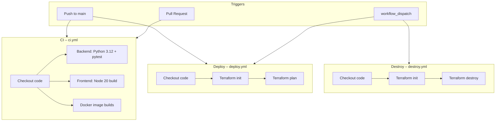

# Pharmacy AI Assistant

Educational full-stack RAG application tailored as a **pharmacy assistant** focused on:

- **Medication identification** (tablet imprint codes, NDC concepts)
- **DEA controlled-substance schedules** and pharmacist corresponding responsibility

Built for the AICO Assessment III requirements (RAG + Mem0, Docker, Terraform, GitHub Actions, documentation) with pharmacy-domain specialization.

> **Disclaimer:** This is an educational prototype only. It is **not** a clinical decision-support system, **not** a substitute for a licensed pharmacist, and **not** legal advice. Always verify against current DEA / FDA primary sources and professional judgment.

## Features

- Hybrid RAG over pharmacy knowledge base (Chroma + LangChain)
- Medication identification by imprint code / name / NDC concepts
- DEA Schedule I–V explanations and corresponding-responsibility guidance
- FastAPI backend + React (Vite) frontend
- Optional local Ollama or cloud LLM
- Optional Mem0 memory
- Docker Compose local stack
- Terraform AWS scaffolding (EC2 + security group)
- GitHub Actions CI / deploy / destroy workflows

## Architecture

```
Frontend (React / Vite)  →  FastAPI Backend  →  LangChain RAG + Chroma
                                      ↓
                               Ollama / OpenAI (optional)
                                      ↓
                               Mem0 (optional memory)
```

- **Backend:** FastAPI, LangChain, Chroma vector store, pharmacy-specific prompts
- **Frontend:** Chat UI with dedicated Medication ID and DEA quick-prompt modes
- **Infra:** `docker-compose.yml` for local full stack; Terraform and Actions for cloud/CI

## Quick Start (Docker)

```bash
# 1. Clone
git clone https://github.com/bjslusher/pharmacy-ai-assistant.git
cd pharmacy-ai-assistant

# 2. Environment (optional)
cp backend/.env.example backend/.env
# Edit as needed (Ollama URL, Mem0 key, etc.)

# 3. Ensure Ollama models are available
#    ollama pull llama3
#    ollama pull nomic-embed-text

# 4. Start the stack
docker compose up --build
```

- Frontend: http://localhost:3000  
- Backend API docs: http://localhost:8000/docs  
- Health: http://localhost:8000/api/health  

## Key API Endpoints

| Method | Path | Purpose |
|--------|------|---------|
| GET | `/api/health` | Health + indexed document count |
| POST | `/api/chat` | General pharmacy RAG chat |
| POST | `/api/meds/identify` | Imprint / medication identification mode |
| POST | `/api/dea/query` | DEA schedules & corresponding-responsibility mode |

## Knowledge Base

Educational seed documents live in `backend/source_data/`:

| File | Content |
|------|---------|
| `common_controlled_imprints.txt` | Expanded common Schedule II / III / IV tablet imprint examples |
| `dea_schedules_overview.txt` | Schedules I–V + corresponding responsibility overview |
| `pharmacist_responsibilities.txt` | Corresponding responsibility and compliance notes |

**Imprint identification is limited to the educational examples in the seed data.** It is not a live commercial pill identifier. Unknown codes will be refused or answered with low confidence and a redirect to official tools.

## CI/CD Pipeline

This project uses **GitHub Actions** for continuous integration, deployment planning, and infrastructure teardown. All workflows live under `.github/workflows/`.

### Pipeline overview



### What each workflow does

| Workflow | File | When it runs | What it does |
|----------|------|--------------|--------------|
| **CI** | `ci.yml` | Every **push** and **pull request** to `main` | Installs Python deps, compiles backend modules, runs unit tests (`expand_query`, API models, RAG helpers — no live Ollama), installs frontend deps and builds the Vite app, builds backend and frontend Docker images to prove they still compile |
| **Deploy** | `deploy.yml` | **Manual** (`workflow_dispatch`) or push that touches app/infra paths | Checks out code, sets up Terraform, runs `terraform init` + `validate` + `plan` using optional AWS secrets. **Plan-first by design** — no automatic apply, so assessment reviewers cannot accidentally create paid cloud resources |
| **Destroy** | `destroy.yml` | **Manual only** (`workflow_dispatch`) | Runs `terraform destroy` when AWS secrets are present; otherwise exits safely as a scaffold. Prevents accidental teardown from a normal push |

### Required GitHub secrets (deploy / destroy only)

| Secret | Purpose |
|--------|---------|
| `AWS_ACCESS_KEY_ID` | AWS credentials for Terraform |
| `AWS_SECRET_ACCESS_KEY` | AWS credentials for Terraform |
| `AWS_REGION` | Optional; defaults to `us-east-1` if unset |

CI does **not** need AWS secrets; it only builds and tests.

### Local equivalents of CI

```bash
# Backend unit tests (no live LLM required)
cd backend
pip install -r requirements.txt pytest
pytest -q tests/

# Frontend build
cd frontend
npm ci || npm install
npm run build

# Docker proof
docker build -t pharmacy-backend ./backend
docker build -t pharmacy-frontend ./frontend
```

### Design notes

- **CI is fast and offline-friendly** — unit tests mock embeddings/LLM where needed so the pipeline does not depend on a live Ollama service.
- **Deploy is plan-first** — avoids accidental infrastructure changes during assessment review.
- **Destroy is manual-only** — prevents accidental teardown from a normal push.
- **Single pusher process** — team drafts workflow changes; Grok reviews, tests, and is the only agent that commits updates to `main`.

## Official Sources (do not commit full PDFs)

### DEA – Controlled Substances & Pharmacy Practice
| Resource | Link |
|----------|------|
| Pharmacist's Manual (2022 PDF) | https://www.deadiversion.usdoj.gov/GDP/(DEA-DC-046R1)(EO-DEA154R1)_Pharmacist's_Manual_DEA.pdf |
| Controlled Substances by Drug Code | https://www.deadiversion.usdoj.gov/schedules/orangebook/d_cs_drugcode.pdf |
| eCFR 21 CFR Part 1308 (Schedules) | https://www.ecfr.gov/current/title-21/chapter-II/part-1308 |
| Drug Scheduling overview | https://www.dea.gov/drug-information/drug-scheduling |
| Publications & Manuals index | https://www.deadiversion.usdoj.gov/pubs/manuals/manuals.html |

### FDA – Medication Identification
| Resource | Link |
|----------|------|
| NDC Directory | https://www.fda.gov/drugs/drug-approvals-and-databases/national-drug-code-directory |
| Orange Book data files | https://www.fda.gov/drugs/drug-approvals-and-databases/orange-book-data-files |
| openFDA NDC API | https://open.fda.gov/apis/drug/ndc/ |
| DailyMed | https://dailymed.nlm.nih.gov/dailymed/ |

See also [`docs/sources.md`](docs/sources.md).

## Assessment Mapping

| Area | Coverage |
|------|----------|
| RAG / LangChain / Mem0 | `backend/rag_service.py`, pharmacy prompts, Chroma, optional Mem0 |
| Docker | `backend/Dockerfile`, `frontend/Dockerfile`, `docker-compose.yml` |
| Terraform (AWS) | `terraform/main.tf`, `terraform/variables.tf` |
| CI/CD (GitHub Actions) | `ci.yml`, `deploy.yml`, `destroy.yml` |
| Tests | `backend/tests/` (expand_query, API models, RAG helpers) |
| Domain specialization | Pharmacy prompts, imprint seed data, DEA educational focus |
| Documentation | This README + `docs/sources.md` |

## Important Limitations

- Imprint identification uses a **limited educational sample**, not a complete or live database.
- Controlled-substance answers must be verified against the current Pharmacist's Manual and 21 CFR 1308.
- No patient-specific data should be entered; this is a public educational demo.
- Counterfeit tablets are a known risk—visual identification alone is never sufficient for safety-critical decisions.

## License / Use

Educational assessment project. Government source material remains subject to its own terms; summaries in this repository are for learning only.
